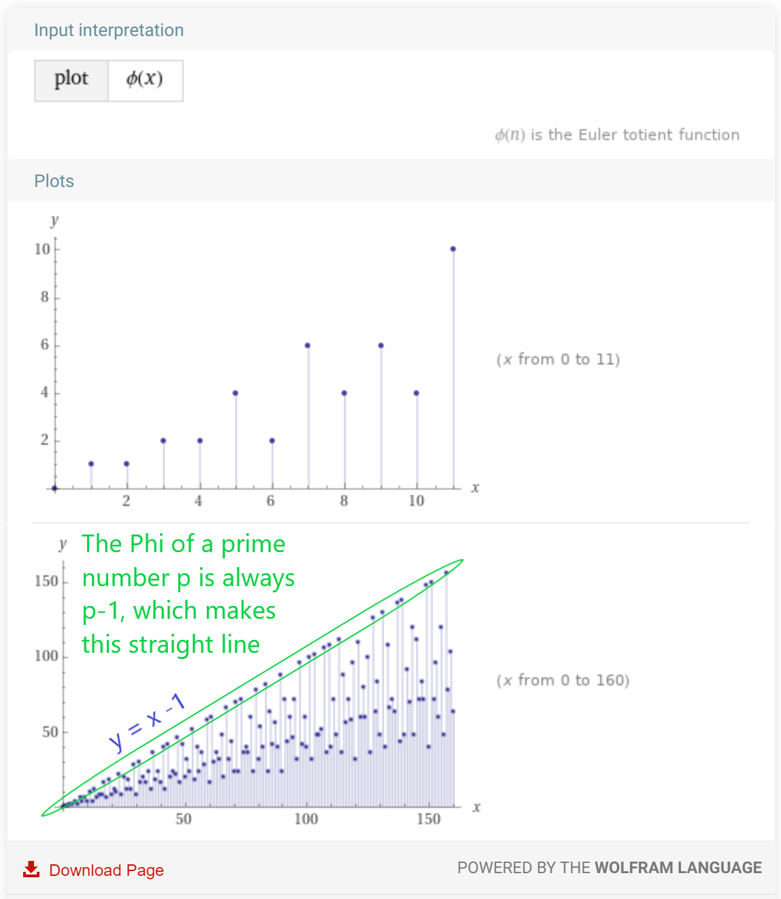

## Euler's Totient Function



Euler investigated the distribution of prime numbers

## Phi function φ(n)

Phi is a Greek letter pronounced either as "fy" or like the word "fee"
The Phi function takes a number N and counts how many numbers less than N have a greatest common denominator of one with N. In other words it counts the number of coprimes N has with all the numbers less than N.

**e.g. to calculate the Phi of 8 or φ(8)**

1. Write down all the numbers from one to eight:
   1
   2
   3
   4
   5
   6
   7
   8
1. Find all the numbers that have common factors with 8 and cross them out
   **1**
   ~~2~~
   **3**
   ~~4~~
   **5**
   ~~6~~
   **7**
   ~~8~~
1. Count the numbers remaining: 1, 3, 5 and 7. So there are 4 numbers that are coprime with 8 that are less than 8
1. That is your answer: φ(8) = 4

This is quite a difficult thing to calculate for large numbers because you have to go through all of the numbers and find if they have common factors or not.

However, it is easy to find the Phi of a prime number. Because prime numbers do not share factors with any other numbers then the Phi of a prime number will always be one less than the prime number (every number less than the prime) [^penn] [^khan]. You can see this by trying the same steps steps for the number seven. Let's do that now:

**e.g. to calculate the Phi of 7 or φ(7)**

1. Write down all the numbers from one to seven:
   1
   2
   3
   4
   5
   6
   7
1. Find any common factors those numbers have with seven and cross them out
   **1**
   **2**
   **3**
   **4**
   **5**
   **6**
   ~~7~~
1. Count the numbers that don't have common factors: 6
1. That is your answer: φ(7) = 6
1. It makes sense because 7 is a prime number and will have no common factors with any other number below it.

Because all prime numbers do not have common factors with other numbers the Phi of a prime number will always be one less than the prime number. So, now if we represent prime numbers as the letter p, then we can say that the Phi of p is p minus one, or:

φ(p) = p-1

**e.g. Phi of 21377 (which is a prime number) is 21376. Easy!**

## Why is this important to RSA encryption?

RSA encryption uses a relationship between two prime numbers (p and q) and the totient of those prime numbers to create the encryption and decryption keys:

- The encryption key uses the result of p multiplied by q: N=p.q
- The decryption key uses the result of the Phi of p multiplied by the Phi of q: φ(p) . φ(q) = (p-1).(q-1)

The magic thing about φ(p) . φ(q) is that it is the same as φ(p.q)
So, φ(N) = φ(p.q) = φ(p) . φ(q) = (p-1).(q-1)

**e.g. the Phi of 7 is 6 and the Phi of 11 is 10, the Phi of 7 times 11 is Phi of 77 which equal 60.**

## Phi of all numbers to 150 plotted on a graph


[^wolfram]

## Mathematics

φ(p.q) = φ(p) . φ(q)

So, if we know a number N that is the product of two primes:
N=p.q

Then we also know that:

φ(N) = φ(p) . φ(q)

And since we know that the Phi of a prime number is the number minus one, then:
φ(N) = (p-1) . (q-1)

We will use this property of two prime numbers and their product later when calculating RSA encryption and decryption.

## Finding Phi(n)



Or run these examples from the command line:

```
$ python rsa_demo.py phi -n 29
28

$ python rsa_demo.py phi -n 31
30

$ python rsa_demo.py phi -n 30
8

```

## References

[^khan]: <https://youtu.be/qa_hksAzpSg> Khan Academy Labs - Euler's Totient
[^penn]: <https://www.youtube.com/watch?v=2JY3P3aHUJk> Michael Penn - Euler's Totient
[^wolfram]: Wolfram Alpha LLC. 2009. Wolfram\|Alpha. <https://www.wolframalpha.com/input/?i=plot+phi+of+x> (access September 12, 2021).


