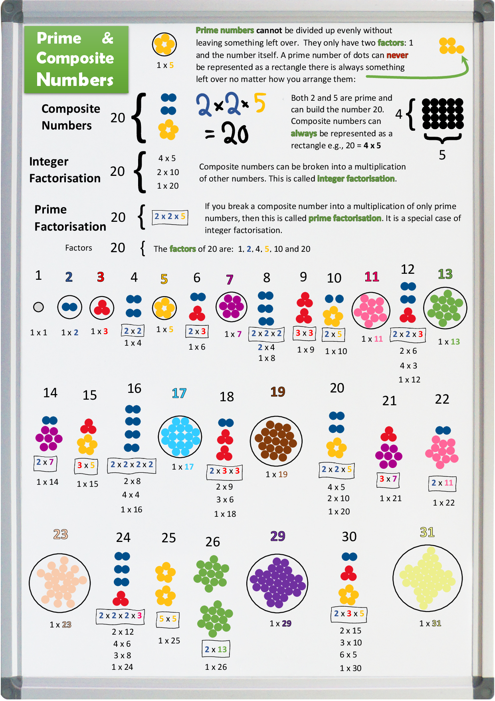

## Integers Factors and Prime Numbers

<nav>
  <ul>
    <li><a href="./index">Index</a></li>
    <li><a href="./About">About</a></li>
    <!-- <li><a href="./What-is-cryptography">What is cryptography</a></li> -->
    <li><a href="./Integer-Factors-and-Prime-Numbers"><strong>Integers, Factors and Prime Numbers</strong></a></li>
    <li><a href="./Modular-arithmetic">Modular arithmetic</a></li>
    <li><a href="./Euler's-Totient-Function">Euler's Totient Functions</a></li>
  </ul>
</nav>

Prime numbers (along with some mathematics) are used in RSA encryption to create encryption and decryption keys. They are the reason RSA is such a powerful encryption algorithm. So, it is helpful for us to understand what integers are, what prime numbers are and some of their properties.

## Integers

**Integers** are the entire set of **whole** numbers, both positive and negative (as well as zero): ... -5, -4, -3, -2 , -1, 0, 1, 2, 3, 4, 5, ...

## Factors

Some integers can be generated by multiplying other integers together. These are called the factors of the number.

## Factorisation

Factorising is where you have an answer to multiplication and want to find which two numbers were multiplied together to get that answer. An example is the number 20. It can be made up a number of ways by multiplying integers together: 4 x 5 = 20 and 2 x 10 = 20 and 1 x 20 = 20. So, the **factors** of 20 are said to be 1, 2, 4, 5, 10 and 20.

## Composite numbers

Numbers like 20 that can be made up by multiplying other integers together are called **composite numbers** because they are said to be composed of other integers. All of the boring black numbers in the diagram are composite numbers.

**Prime numbers** are numbers that cannot be broken down into a multiplication of other integers. A prime number has only two factors: 1 and the number itself are the only factors of a prime number. An example is the number 5. You can not multiply two other integers together to get 5, only 1 x 5 = 5. So its only factors are 1 and itself. This makes it a **prime number**. All the prime numbers in the diagram below are coloured and have a circle around them because they are very special. They are represented as colourful dots arranged into **unique snowflakes**.

You can see in the diagram that all of the non-prime integers can be made up by multiplying prime numbers together. This is what makes prime numbers so special, they are unique and can not be broken down into smaller multiples.

These properties of integers and multiplication are used in RSA encryption.

## One is the loneliest number

By definition, a prime number must have two distinct factors and 1 only has one factor: 1 x 1 = 1. There are no distinct numbers in that multiplication, so one can not join the prime club. Poor old 1. Zero is just as lonely as 1, but at least zero can be divided by all the other numbers. Zero is not prime either.

This infographic shows all of these concepts for the integers from 1 to 31.



## Co-prime
When a number shares no factors with another number other than 1 they are said to be **coprime**.

An example is 21 and 22. you can see from the diagram that:
* 21 has factors **1**, 3, 7, 21
* 22 has factors **1**, 2, 11, 22
* They only share a factor of **1**, so they are coprime.
21 is not a prime number and neither is 22 but they are **coprime**.

## Python examples

### Find prime numbers
You can run these examples online from here: [online-python-link]  
[![online-python][online-python-image]][online-python-link]  

[online-python-link]: https://www.online-python.com/SZCBYGAke8
[online-python-image]: ./images/online-python.png (online-python)
[how-to-link-with-an-image]: https://meta.stackexchange.com/questions/2133/whats-the-recommended-syntax-for-an-image-with-a-link

**Or** if you have the example python code checked out from here: https://github.com/nhoyle-unsw/learn-encryption-with-python/ you can run this from the command line like this:

```console
$ python rsa_demo.py prime -n 0
False

$ python rsa_demo.py prime -n 1
False

$ python rsa_demo.py prime -n 2
True

$ python rsa_demo.py prime -n 3
True

$ python rsa_demo.py prime -n 4
False

$ python rsa_demo.py prime -n 5
True

$ python rsa_demo.py prime -n 127
True

$ python rsa_demo.py prime -n 123456789
False

$ python rsa_demo.py prime -n 1234577  
True

```

**Source code:** https://github.com/nhoyle-unsw/learn-encryption-with-python/blob/main/primes.py#L8

### Calculate factors of numbers

```console
$ python rsa_demo.py factors -n 5
1

$ python rsa_demo.py factors -n 24
1 2 3 4 6 8 12 
```
**Source code:** https://github.com/nhoyle-unsw/learn-encryption-with-python/blob/main/factors.py#L36

## References
[1] https://www.mathsisfun.com/definitions/coprime.html
