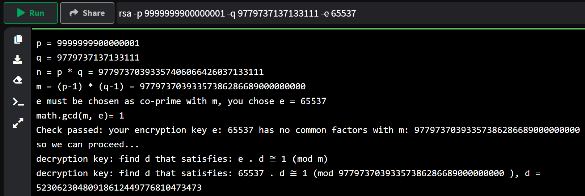
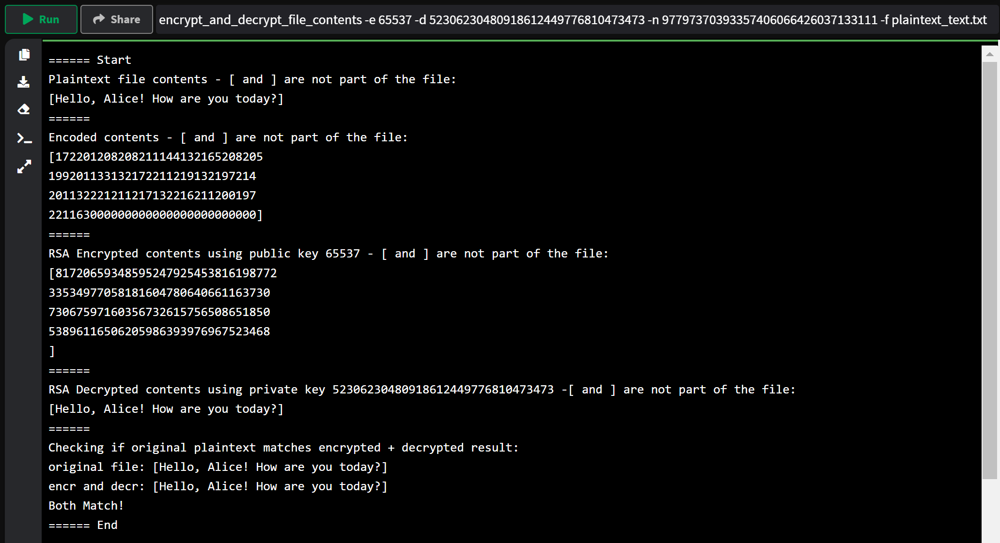

## RSA Encryption and Decryption



RSA is an acronym made up from the surnames of its inventors [^1]:

- Ronald **R**ivest:
- Adi **S**hamir:
- Leonard **A**dleman:

**Ronald Rivest** also invented RC2, 4, 5 and 6 symmetric key encryption algorithms as well as the well the MD2, 4, 5 and 6 family of hash functions. [^2]

**Adi Shamir** was a co-discoverer of [Differential Cryptanalysis](https://en.wikipedia.org/wiki/Differential_cryptanalysis), which was later revealed to have been already known by IBM and the NSA. [^3]

**Leonard Adleman** is widely referred to as the Father of DNA Computing, where DNA is used to compute an algorithm. He is also the co-discoverer fo the Adleman–Pomerance–Rumely primality test. [^4]

## History

The RSA algorithm was published in in 1977, but again, there was an equivalent system that was developed by the British signals intelligence agency (GCHQ) in 1973 [^1], but they kep this a secret.

RSA is a public-key encryption system where an encryption/decryption key is published for everyone to know and a second decryption/encryption key is kept secret or private. The great thing about this is the public key can be known by everyone an can be used to decrypt messages from the owner of the private key. It also means you can verify that the message came from the owner of the private key. The public key can also be used to encrypt a message to send to the private key owner that no one else can decrypt. Because the two keys are different this is known as asymmetric encryption. This was a huge thing in cryptography because up until this point we only had symmetric cryptography where you both had to know the same secret key and it had to be shared between the sender and the receiver. Now you only had to share the public key and you could be assured that no one else has the private key. [^pkc]

To send a private message to someone you just need to know their public key. If they want to send a private message back to you all they need to know is your public key. So no one can intercept the communication between you both. [^1]

## Security

The security of RSA relies on the fact that it is very hard (in computing time) to find the factors of the product of two large prime numbers, this is known as the "factoring problem" [^1].

RSA requires two large prime numbers to be used to create the public and the private keys. The two prime numbers are kept secret also and can be discarded as they are not needed for the encryption and decryption to take place. There are so many large prime numbers that it is almost impossible to guess which two primes were used to generate the public and private keys. Also, it is practically impossible to guess the private key if you now the public key. [NIST](https://www.nist.gov/) recommends to use at least 3072 length modulus to prevent practical factorisation as this provides 128 bits of security. [^nist]

When we say "practically impossible" we mean that it would take so long to calculate that you would need more than all the computers in the world working for longer than the age of the universe to be able to factorise the modulus. [^integer-factorisation]

Distinct from the "factoring problem" mentioned above there is also the "RSA problem" which is about breaking the RSA algorithm by using only the public key.
For RSA key sizes that are in excess of 1024 bits there is no known efficient method for solving this problem [^5]. If ever a method was developed that could solve the RSA problem efficiently then it could threaten current crypto systems or eventual security of systems that used it in the past as a way to encrypt information.

There have been reports of progress towards cracking RSA encryption using Shor's algorithm [^shor] and quantum computers as seen in [Quantum Computer Factoring](https://spectrum.ieee.org/encryptionbusting-quantum-computer-practices-factoring-in-scalable-fiveatom-experiment), but this has only been done for the number 15 [^6]. However, it appears that this factorisation of 15 into 3 x 5 may be classified informally as one of the "stunt" factorisations where experiments are set up knowing the factors already, which is not a valid test of an algorithm that is supposed to be finding unknown factors. So it seems a long way off at the moment. But we should be prepared for it to work one day.

An interesting piece of information from NIST is: "The NIST Special Publication on Computer Security (SP 800-78 Rev 1 of August 2007) does not allow public exponents e smaller than 65537, but does not state a reason for this restriction." They may have some insight into how RSA encryption can be compromised, but they are not sharing the information. [^1]

## RSA Key generation

Alice can create an RSA public key and private key using the following method (with example on the right). **Note:** I have used an example that matches one from the Fundamentals of Security Engineering course [^sec-eng] to allow other students to follow the example, but you do not need to have seen this example to follow below. We will do a more realistic example once you understand the basic steps.

| Step | Procedure&nbsp;&nbsp;&nbsp;&nbsp;&nbsp;&nbsp;&nbsp;&nbsp;&nbsp;&nbsp;&nbsp;&nbsp;&nbsp;&nbsp;&nbsp;&nbsp;&nbsp;&nbsp;                                                                                                    | Example&nbsp;&nbsp;&nbsp;&nbsp;&nbsp;&nbsp;&nbsp;&nbsp;&nbsp;&nbsp;&nbsp;&nbsp;&nbsp;&nbsp;&nbsp; | Comment&nbsp;&nbsp;&nbsp;&nbsp;&nbsp;&nbsp;&nbsp;&nbsp;&nbsp;&nbsp;&nbsp;&nbsp;                                          |
| ---- | ------------------------------------------------------------------------------------------------------------------------------------------------------------------------------------------------------------------------ | ------------------------------------------------------------------------------------------------- | ------------------------------------------------------------------------------------------------------------------------ |
| 1    | Generate two prime numbers **_p_** and **_q_** that are different to each other, but around about the same size, but not too close to each other (see Security Notes).                                                   | p = 557 q = 839                                                                                   | both prime numbers                                                                                                       |
| 2    | Calculate **_n_** = **_p_** x **_q_** - this will be used as the modulus                                                                                                                                                 | n = p \* q = 467323                                                                               | n is part of the public key                                                                                              |
| 3    | Calculate the totient of the primes **_m_** = φ(**_n_**) = φ(**_p_**).φ(**_q_**) = (**_p_**-1).(**_q_**-1)                                                                                                               | m = (p-1) \* (q-1) = 465928                                                                       | m is used to calculate the decryption key                                                                                |
| 4    | Choose your encryption key **_e_** : which needs to be larger that 1 and less than **_m_**. Also **_e_** and **_m_** should be coprime. So their greatest common denominator should be 1. So, gcd(**_e_**, **_m_**) = 1. | e = 7825                                                                                          | e is co-prime with m                                                                                                     |
| 5    | Calculate the decryption key **_d_**. We do this by finding the modular multiplicative inverse for **_e_** in this equation: **_e_**.**_d_** ≅ 1 (mod **_m_**).                                                          | 7825 . d ≅ 1 (mod 465928)                                                                         | inverse of 7825 mod 465928 at [WolframAlpha](https://www.wolframalpha.com/input/?i=inverse+of+7825+mod+465928)           |
| 6    | The private key is **_d_**                                                                                                                                                                                               | d = 214833                                                                                        | Alice uses d and n to decrypt a message from anyone                                                                      |
| 7    | The public key is both **_n_** and **_e_**                                                                                                                                                                               | n = 467323 e = 7825                                                                               | Alice published the encryption key e and the number n as the public key. Anyone can encrypt messages for her to decrypt. |
| 8    | Throw away the other numbers, you don't need them.                                                                                                                                                                       |                                                                                                   | Alice no longer needs p, q or m. So, she discards them safely.                                                           |

All of the above steps can be completed in one call to the python program to generate the RSA public and private keys like this:

`rsa -p 557 -q 839 -e 7825`




Or using the code from GitHub like this:

```
$ python rsa_demo.py rsa -p 557 -q 839 -e 7825
p = 557
q = 839
n = p * q = 467323
m = (p-1) * (q-1) = 465928
e must be chosen as co-prime with m, you chose e = 7825
math.gcd(m, e)= 1
Check passed: your encryption key e: 7825 has no common factors with m: 465928 so we can proceed...
decryption key: find d that satisfies: e . d ≅ 1 (mod m)
decryption key: find d that satisfies: 7825 . d ≅ 1 (mod 465928 ), d = 214833
```

## RSA Encryption - Bob using public key to encrypt

1. Bob has a message "RSA" to encrypt and send to Alice.
1. Convert the message to a number using the position of the letter in the alphabet: R=18, S=19 A=01, so we have 181901.
1. To encrypt this message, all we need to do is calculate the following:

   x<sup>e</sup> mod n = 181901 <sup>7825</sup> mod 467323

   which we can do online like this:

   `power_mod -a 181901 -b 7825 -n 467323`

   

   Or using the code like this:

   ```
   $ python rsa_demo.py power_mod -a 181901 -b 7825 -n 467323
   183780
   ```

1. Bob can now send this secret message to Alice

## RSA Decryption - Alice using private key to decrypt

1. For Alice it is pretty simple to decrypt. It is the opposite steps to Bob.
1. To decrypt, Alice calculates the following:

   y<sup>d</sup> mod n = 183780 <sup>214833</sup> mod 467323

   which we can do online like this:

   ```
   power_mod -a 183780 -b 214833 -n 467323
   181901
   ```

   

   Or using the code like this:

   ```
   $ python rsa_demo.py power_mod -a 183780 -b 214833 -n 467323
   181901
   ```

1. Alice now needs to turn the numbers 181901 back into letters. 18=R, 19=S, 01=A
1. The message is RSA.

Too easy, now for something a bit more realistic.

## Demonstration of practical use of RSA

Now that the basic example is out of the way, let's look at a real example of a much longer message being encrypted, sent to Alice and then decrypted to re-produce the file as it was.

**Note:** although this is a realistic demonstration of the application of RSA, this should not be used in the real world as it is not secure. The 16 digit primes for this example were sourced from: [^9] and [^10]

The message that Bob sent Alice above was only possible because the message was so small. With RSA you can only encrypt a number that is smaller than the modulo n. In the above example this was 467323. So we can only encrypt three letters at the most. This is not very practical. It is good for learning how it works though as the numbers are quite small. So, now lets see how we can encrypt and decrypt a text file of any size at all.

### Problems

The problems we have are:

1. We need to allow for more characters of the alphabet (upper and lower) as well as numbers and symbols
1. We need a way to break a message apart into chunks (or blocks) and encrypt each block.
1. We probably need a much bigger modulo n, so we will need to start with much bigger p and q prime numbers.
1. We need to be able to reverse all of the above so that the original file is returned to Alice in plaintext form as it was first created by Bob.

### Solutions

1. For how to add more characters, numbers and symbols see <a href="Text-conversion-and-blocks#conversion-of-text-to-numbers">Conversion of text to numbers</a> - this scheme has 3 digits for each character.
1. For how to chunk up the text into manageable blocks see: <a href="Text-conversion-and-blocks#breaking-text-up-into-blocks">Breaking text up into blocks</a>
1. For bigger primes see [^9]. I chose the following two 16 digit primes for this example:  
   p = 9999999900000001  
   q = 9779737137133111
1. This will give us a modulo n that is 32 digits long. This fits nicely with the character encoding scheme chosen above because we have three digits per character, so we will be able to encrypt 10 characters at a time. This gives us our block size.
1. The last problem is how it can be all made to encode, encrypt, decrypt and decode back into the original plaintext file. Well, this is where python will help us. We can re-use the demonstration code written for learning to do just that in a repeatable fashion.

## Practical example

We can now use all of the parts we have been over to do a complete end to end encryption and decryption. We wil start with generating the public and private keys.

### Generate RSA public and private keys

using the above two prime numbers **_p_** and **_q_** and a chosen encryption key **_d_**. I chose d=65537 because it is co-prime with p.q (the python code will check tht for you). It also might be more efficient for certain algorithms due to there only being two 1 in its binary form (10000000000000001) [^7]. Here is how to calculate the RSA keys:

`rsa -p 9999999900000001 -q 9779737137133111 -e 65537`





Or using the code from GitHub like this:

```
$ python rsa_demo.py rsa -p 9999999900000001 -q 9779737137133111 -e 65537
p = 9999999900000001
q = 9779737137133111
n = p * q = 97797370393357406066426037133111
m = (p-1) * (q-1) = 97797370393357386286689000000000
e must be chosen as co-prime with m, you chose e = 65537
math.gcd(m, e)= 1
Check passed: your encryption key e: 65537 has no common factors with m: 97797370393357386286689000000000 so we can proceed...
decryption key: find d that satisfies: e . d ≅ 1 (mod m)
decryption key: find d that satisfies: 65537 . d ≅ 1 (mod 97797370393357386286689000000000 ), d = 52306230480918612449776810473473
```

So, we have:
public key e = 65537 (share this with everyone)  
modulo n = 97797370393357406066426037133111 (share this with everyone)  
private key d = 52306230480918612449776810473473 (keep this secret, Alice!)

Next, we just need a message to encrypt. Let's try a small example first so we can test that it works:
Let's get Bob to say **_"Hello, Alice! How are you today?"_**.

You can see this plaintext in the following file: [plaintext_text.txt](https://github.com/nhoyle-unsw/learn-encryption-with-python/blob/main/plaintext_text.txt). Here is the command to encode, encrypt, and decrypt that file. The log shows the progress at each step of the way and at the end compares the original input to the decrypted output to make sure they match:

`encrypt_and_decrypt_file_contents -e 65537 -d 52306230480918612449776810473473 -n 97797370393357406066426037133111 -f plaintext_text.txt`





Or using the code from GitHub like this:

```
 python rsa_demo.py encrypt_and_decrypt_file_contents -e 65537 -d 52306230480918612449776810473473 -n 97797370393357406066426037133111 -f plaintext_text.txt
====== Start
Plaintext file contents - [ and ] are not part of the file:
[Hello, Alice! How are you today?]
======
Encoded contents - [ and ] are not part of the file:
[172201208208211144132165208205
199201133132172211219132197214
201132221211217132216211200197
221163000000000000000000000000]
======
RSA Encrypted contents using public key 65537 - [ and ] are not part of the file:
[81720659348595247925453816198772
33534977058181604780640661163730
73067597160356732615756508651850
53896116506205986393976967523468
]
======
RSA Decrypted contents using private key 52306230480918612449776810473473 -[ and ] are not part of the file:
[Hello, Alice! How are you today?]
======
Checking if original plaintext matches encrypted + decrypted result:
original file: [Hello, Alice! How are you today?]
encr and decr: [Hello, Alice! How are you today?]
Both Match!
====== End
```

Look! The original plaintext matches the processed text perfectly. That was only a small example, now lets do a large file with complex characters in it to make sure our code is working as required.

### A large complex file

The final test for the RSA block scheme that has been implemented is to accurately encrypt and decrypt a complex file. Have look at the example file [here](https://github.com/nhoyle-unsw/learn-encryption-with-python/blob/main/plaintext_long_length.txt) in which you can see a very complex structure that would be ruined if anything went missing. It is also quite a lot longer than the previous example. Let's cross our fingers for this one. Again, here is the command for encrypting and decrypting the large text file:

`encrypt_and_decrypt_file_contents -e 65537 -d 52306230480918612449776810473473 -n 97797370393357406066426037133111 -f plaintext_long_length.txt`




To see how Darth Vader fared, please run the example yourself as the output is too long to screenshot.

Or using the code from GitHub like this:

```
$ python rsa_demo.py encrypt_and_decrypt_file_contents -e 65537 -d 52306230480918612449776810473473 -n 97797370393357406066426037133111 -f plaintext_long_length.txt
====== Start
Plaintext file contents - [ and ] are not part of the file:
[Hello, Alice! How are you today?
I'm well, thanks, before you ask me.

I'm sure this implementation is not secure, it is only for learning and demonstration purposes. You know what they say: "Never roll your own crypto!"

How about this RSA algorithm for encrypting and decrypting arbitrary text files of any length?
Amazing, huh?

Here are some crazy characters:

~!@#$%^&*()_+`1234567890-={}|[]\:";'<>?,./

And some ascii art:

Art by Shanaka Dias
                       .-.
                      |_:_|
                     /(_Y_)\
.                   ( \/M\/ )
 '.               _.'-/'-'\-'._
   ':           _/.--'[[[[]'--.\_
     ':        /_'  : |::"| :  '.\
       ':     //   ./ |oUU| \.'  :\

...
(I wont spoil the ending for you, you will need to run this yourself!)
====== End
```

OK, so [here is the output I got](https://github.com/nhoyle-unsw/learn-encryption-with-python/blob/main/plaintext_long_length.txt_output.txt), but you have to try it yourself ;)

## Fin

That concludes the practical demonstration of RSA being used in a near-real-world example. I hope you enjoyed learning and participating. Please feel free to raise any issues at: [https://github.com/nhoyle-unsw/learn-encryption-with-python/issues](https://github.com/nhoyle-unsw/learn-encryption-with-python/issues)

**_Remember: Never roll your own crypto_**  
(unless it is for learning and demonstration purposes)

## Security notes

1. In practice these two selected prime numbers should be large and randomly selected. There other considerations to make the possibility of attacks less likely. This is one reason why you should never implement your own encryption as the mathematics behind it is very complex. I do not fully understand the choices that make RSA weaker or stronger which is why this code should only be used for demonstration purposes.
2. Additional security concerns are left to the reader in [^7] and [^8]

## References

[^1]: <https://en.wikipedia.org/wiki/RSA_(cryptosystem)>
[^2]: <https://en.wikipedia.org/wiki/Ron_Rivest>
[^3]: <https://en.wikipedia.org/wiki/Adi_Shamir>
[^4]: <https://en.wikipedia.org/wiki/Leonard_Adleman>
[^5]: <https://en.wikipedia.org/wiki/RSA_problem>
[^6]: <https://spectrum.ieee.org/encryptionbusting-quantum-computer-practices-factoring-in-scalable-fiveatom-experiment>
[^7]: <https://cacr.uwaterloo.ca/hac/>
[^8]: <https://cacr.uwaterloo.ca/hac/about/chap8.pdf>
[^9]: Source of 16 digit primes used for my demonstration <https://primes.utm.edu/curios/index.php?start=15&stop=16>
[^10]: <https://stackoverflow.com/questions/29818519/what-is-the-opposite-of-pythons-ord-function>
[^11]: <https://primes.utm.edu/lists/small/millions/>
[^sec-eng]: <https://www.openlearning.com/unswcourses/courses/eng-principles-21/activities/learnhowrsaworks/?cl=1>
[^pkc]: <https://en.wikipedia.org/wiki/Public-key_cryptography>
[^shor]: <https://en.wikipedia.org/wiki/Shor%27s_algorithm>
[^integer-factorisation]: <https://en.wikipedia.org/wiki/Integer_factorization>
[^nist]: <https://csrc.nist.gov/publications/detail/sp/800-56b/rev-2/final>


